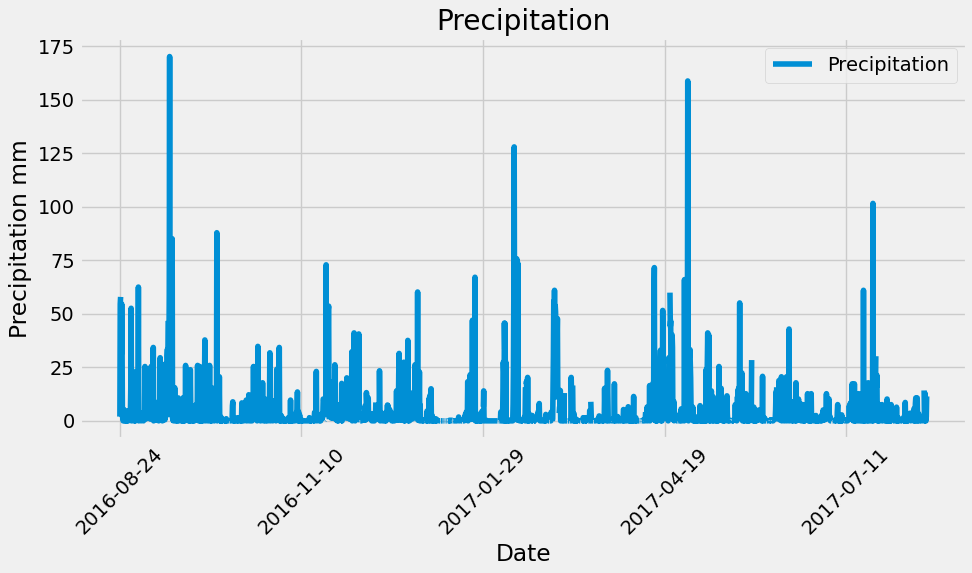
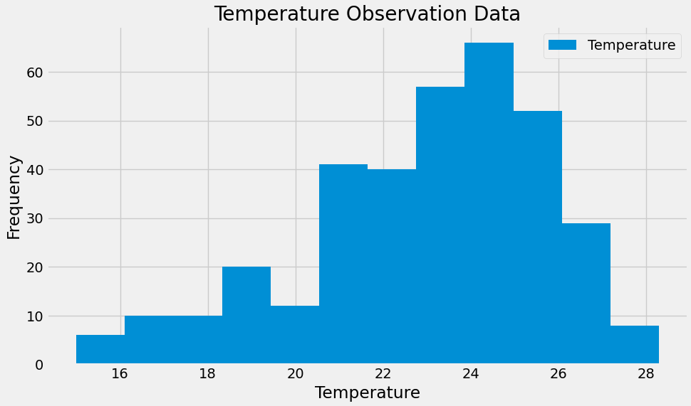

# Sqlalchemy-challenge

## Steps generated before starting

Create a new repository for this project called sqlalchemy-challenge. 

Clone the new repository to your computer.

Inside your local Git repository, create a directory for this Challenge. Use a folder name that corresponds to the Challenge, such as SurfsUp.

Add your Jupyter notebook and app.py to this folder. They’ll contain the main scripts to run for analysis.

Push the changes to GitHub or GitLab.

## Installation

To run the dependencies you need to have the following Python libraries installed:

Matplotlib: It's a Python 2D plotting library which produces publication-quality figures in a variety of hardcopy formats and interactive environments across platforms. You can install it using pip:

```bash
pip install matplotlib
```

NumPy: It's the fundamental package for scientific computing with Python. It provides a high-performance multidimensional array object and tools for working with these arrays. You can install it using pip:

```bash
pip install numpy
```

Pandas: It's an open-source library providing high-performance, easy-to-use data structures and data analysis tools for the Python programming language. You can install it using pip:

```bash
pip install pandas
```

SQLAlchemy: It's a SQL toolkit and Object-Relational Mapping (ORM) library for Python. It provides a way to work with relational databases in an abstract manner. You can install it using pip:

```bash
pip install sqlalchemy
```

Once you have installed these libraries, you will be able to run the code smoothly. Make sure you also have a Python environment set up correctly so that you can import these libraries in your scripts.


### Part 1: Analyzed and explored climate data
  

I used Python and SQLAlchemy to perform basic climate analysis and data exploration of their climate database. Specifically, I used ORM queries from SQLAlchemy, Pandas and Matplotlib. To do so, perform the following steps:


I used the SQLAlchemy create_engine() function to connect to your SQLite database.

I used SQLAlchemy's automap_base() function to mirror its tables into classes and then saved references to the classes named station and measurement.

I linked Python to the database by creating a SQLAlchemy session.

- I obtained the following information:








### Part 2: I designed my weather app

Designed a Flask API based on the developed queries. I used Flask to create routes as follows:

1. /
Start on the home page.

List all available routes.

2. /api/v1.0/precipitation
I converted the query results into a dictionary using the date as the key and prcp as the value.

I returned the JSON representation of your dictionary.

3. /api/v1.0/stations
I returned a JSON list of stations in the dataset.
4. /api/v1.0/tobs
I consulted the dates and temperature observations of the most active season for the previous year of data.

I returned a JSON list of temperature observations from the previous year.

5. /api/v1.0/<home> and /api/v1.0/<home>/<end>
I returned a JSON list of the minimum temperature, average temperature, and maximum temperature for a specific start or start-end range.

For a specific start, I calculated TMIN, TAVG and TMAX for all dates greater than or equal to the start date.

For a specified start date and end date, I calculated TMIN, TAVG, and TMAX for the dates from the start date to the end date, inclusive.

6. I joined the stations and measurements tables for some of the queries.

I used the Flask jsonify function to convert its API data to a valid JSON response object.


## References

- https://blog.miguelgrinberg.com/post/the-flask-mega-tutorial-part-i-hello-world

- https://flask.palletsprojects.com/en/3.0.x/

- https://git.bootcampcontent.com/University-of-Adelaide/UADEL-VIRT-DATA-PT-12-2023-U-LOLC

- https://matplotlib.org/

- https://www.python.org/

- https://numpy.org/

- https://www.sqlalchemy.org/

- https://pandas.pydata.org/docs/

